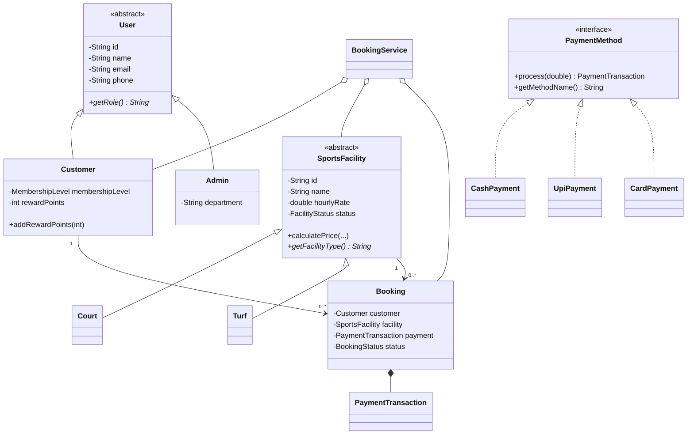

# Class Diagram

```mermaid
classDiagram
    class User {
      <<abstract>>
      -String id
      -String name
      -String email
      -String phone
      +getRole()* String
    }
    class Customer {
      -MembershipLevel membershipLevel
      -int rewardPoints
      +addRewardPoints(int)
    }
    class Admin {
      -String department
    }
    User <|-- Customer
    User <|-- Admin

    class SportsFacility {
      <<abstract>>
      -String id
      -String name
      -double hourlyRate
      -FacilityStatus status
      +calculatePrice(...)
      +getFacilityType()* String
    }
    class Court
    class Turf
    SportsFacility <|-- Court
    SportsFacility <|-- Turf

    class PaymentMethod {
      <<interface>>
      +process(double) PaymentTransaction
      +getMethodName() String
    }
    class CashPayment
    class UpiPayment
    class CardPayment
    PaymentMethod <|.. CashPayment
    PaymentMethod <|.. UpiPayment
    PaymentMethod <|.. CardPayment

    class Booking {
      -Customer customer
      -SportsFacility facility
      -PaymentTransaction payment
      -BookingStatus status
    }
    Customer "1" --> "0..*" Booking
    SportsFacility "1" --> "0..*" Booking
    Booking *-- PaymentTransaction

    class BookingService
    BookingService o-- Customer
    BookingService o-- SportsFacility
    BookingService o-- Booking
```
